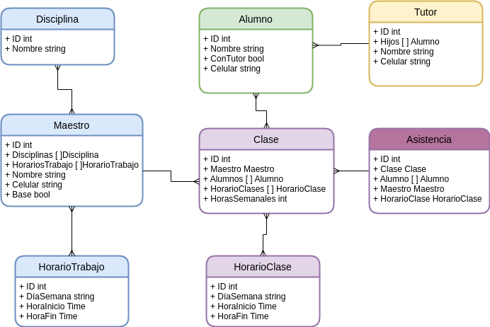

# Documentación Proyecto Class Armony

## Panorama General
Class Armony es un sistema para coordinar las clases en una academia de música, danza o artes en general.

## Objetivos
Coordinar horarios con los maestros y alumnos, llevar registro de asistencia a las clases, etc.

## Infraestructura

### Base Code
TODO:
Grupo y repositorios en donde se aloja el código.

### Storage
#### DBs
TODO:
Bases de datos/colecciones en donde se aloja la data.

## Procesos
Lista de procesos principales del proyecto.

### Proceso - CRUD de Maestros y Alumnos
1. Maestros:
    - Dar de alta Maestros con sus datos.
    - Cambiar datos de Maestros.
    - Dar de baja Maestros.
2. Alumnos:
    - Dar de alta Alumnos con sus datos.
    - Cambiar datos de Alumnos.
    - Dar de baja Alumnos.

### Proceso - Alta de Clases
Crear `Clases` que relacionen un `Maestro` con uno o varios `Alumnos`.
 - Pasos:
   1. Se define qué instrumento/disciplina quiere el alumno.
   2. Se muestran los maestros que pueden dar esa disciplina y sus horarios.
   3. Se selecciona un Maestro y un Horario.
   4. Crear mi `Clase` con el Maestro y Alumno.

### Proceso - Reporte de Alumnos
Generar un reporte de las `Asistencias` que tuvo uno o varios `Alumnos` con fines de pagos, reclamos, etc.

### Proceso - Registro de Asistencia
Llevar la asistencia de alumnos y maestros.
 - Pasos:
   1. Seleccionar `Clase` y marcar asistencia de `Alumno` y `Maestro`, ya sea el principal o el suplente.

## Entidades
 - Maestro: Encargado de dar las clases en la academia.
 - Alumno: La persona que toma la `Clase` en la academia.
 - Tutor: Contacto y responsable de unos o varios `Alumnos` en el caso de que estos sean menores de edad (papás).
 - Clase: Relación entre un `Maestro` y uno o varios `Alumnos` con un horario fijo.
 - Asistencia: Llegada de un `Maestro` y/o `Alumno` a su `Clase`.

## Diagramas
### Diagrama de entidades

## Servicios
Lista de todos los servicios y/o repositorios que forman parte del proyecto.

### Backend API

#### Deployment
Lista de todos los deployments específicos del proyecto.

#### Inputs/Outputs
Entradas/Salidas configuradas.

#### Descripción
Descripción de la funcionalidad del servicio.

#### Procesos
Lista de procesos específicos del servicio.

#### Consideraciones
Casos especiales, hacks, hardcodeos y/o cualquier punto que sea clava y/o importante para el funcionamiento del servicio.

#### Anexos
Documentación y/o hilos importantes relacionados al proyecto.
Aquí podemos listar CHANGELOGs y ADRs por ejemplo.

### Frontend

#### Deployment
Lista de todos los deployments específicos del proyecto.

#### Inputs/Outputs
Entradas/Salidas configuradas.

#### Descripción
Descripción de la funcionalidad del servicio.

#### Procesos
Lista de procesos específicos del servicio.

#### Consideraciones
Casos especiales, hacks, hardcodeos y/o cualquier punto que sea clava y/o importante para el funcionamiento del servicio.

#### Anexos
Documentación y/o hilos importantes relacionados al proyecto.
Aquí podemos listar CHANGELOGs y ADRs por ejemplo.

## Documentos e Hilos Relacionados

